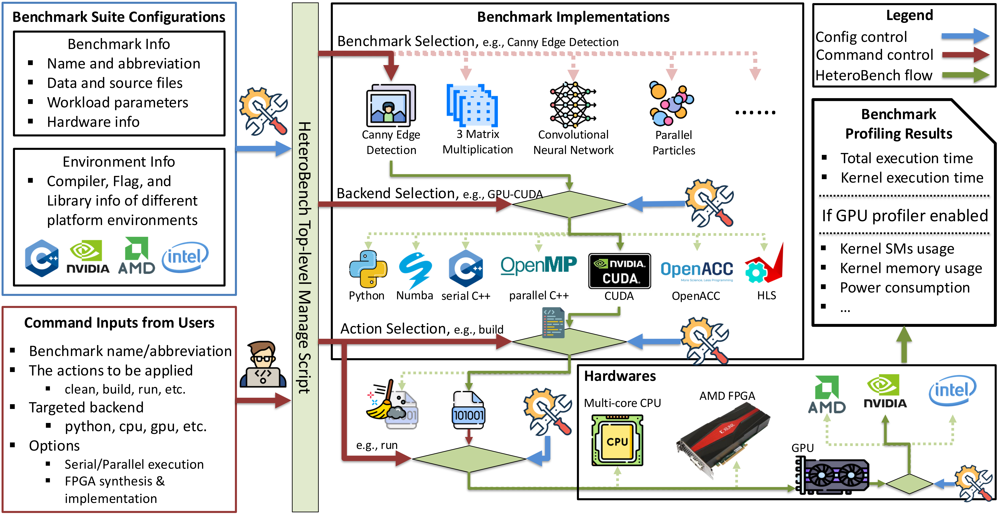

# HeteroBench: Multi-kernel Benchmarks for Heterogeneous Systems

## Description
HeteroBench provides an easy-to-use and flexible framework for benchmarking heterogeneous systems. The architecture overview is shown below:



A top-level Python script manages the entire benchmark suite, enabling smooth execution across various computing platforms including CPUs, GPUs (NVIDIA, AMD, Intel), and FPGAs. Users can easily customize the execution without modifying source code by configuring two JSON files:

- **`env_config.json`**: Defines environment settings such as compilers, compilation flags, and library dependencies for different hardware platforms. Default settings are provided for common use cases.
- **`proj_config.json`**: Specifies benchmark-specific parameters including input/output data paths, tunable variables, and the target hardware backend for each computational kernel.

Benchmark execution is initiated through a command-line interface. Users can specify the benchmark name, desired action (e.g., build, run), target backend (e.g., CPU, GPU), and additional options. The workflow proceeds as follows:

1. The script selects the requested benchmark.
2. It identifies the corresponding code version based on the targeting backend.
3. It compiles and builds the benchmark using the appropriate hardware environment.
4. The benchmark is executed on the specified platform.
5. Profiling results and logs are automatically collected and saved.

This streamlined process allows users to execute and profile benchmarks with a single command, making it straightforward to evaluate performance across heterogeneous systems.

## Included Benchmarks
The suite currently includes benchmarks across four domains:

<table>
  <thead>
    <tr>
      <th><strong>Benchmarks (Abbreviation)</strong></th>
      <th style="text-align: center;"><strong># of Compute Kernels</strong></th>
      <th><strong>Application Domain</strong></th>
    </tr>
  </thead>
  <tbody>
    <tr>
      <td>Canny Edge Detection (ced)</td>
      <td style="text-align: center;">5</td>
      <td rowspan="3">Image Processing</td>
    </tr>
    <tr>
      <td>Sobel Filter (sbf)</td>
      <td style="text-align: center;">3</td>
    </tr>
    <tr>
      <td>Optical Flow (opf)</td>
      <td style="text-align: center;">8</td>
    </tr>
    <tr>
      <td>Convolutional Neural Network (cnn)</td>
      <td style="text-align: center;">5</td>
      <td rowspan="4">Machine Learning</td>
    </tr>
    <tr>
      <td>Multilayer Perceptron (mlp)</td>
      <td style="text-align: center;">3</td>
    </tr>
    <tr>
      <td>Digit Recognition (dgr)</td>
      <td style="text-align: center;">2</td>
    </tr>
    <tr>
      <td>Spam Filter (spf)</td>
      <td style="text-align: center;">4</td>
    </tr>
    <tr>
      <td>3 Matrix Multiplication (3mm)</td>
      <td style="text-align: center;">2</td>
      <td rowspan="2">Numerical Computation</td>
    </tr>
    <tr>
      <td>Alternating Direction Implicit (adi)</td>
      <td style="text-align: center;">2</td>
    </tr>
    <tr>
      <td>Parallelize Particle (ppc)</td>
      <td style="text-align: center;">2</td>
      <td>Physical Simulation</td>
    </tr>
  </tbody>
</table>

> **Note**: Abbreviations will be used throughout the documentation. For detailed descriptions of each benchmark, refer to the corresponding part in the [paper](https://doi.org/10.1145/3676151.3719366).

## Quick Start Guide

### Option 1: Using Docker (Recommended)

Docker provides the simplest way to run HeteroBench without manual environment setup. This is especially useful for reproducibility and testing.

```bash
# Clone the repository
git clone git@github.com:HewlettPackard/HeteroBench.git
cd HeteroBench

# Run the provided script (builds and runs benchmarks in Docker)
./run.sh
```

By default, the script builds and runs benchmarks for CPUs and NVIDIA GPUs using OpenMP, OpenACC, and CUDA. For detailed Docker setup instructions, see [Docker_Setup.md](Docker_Setup.md).

> Note: To add new GPU architectures, run without GPUs, or change new FPGAs, please check [Notes.md](./Notes.md) for more information.

### Option 2: Compile from Source

For users who prefer to compile from source or need to modify the benchmarks, follow the instructions in [Source_Compilation.md](Source_Compilation.md).

## Execution Time Reference

The table below shows the average build and execution time for each scenario on an *AMD EPYC 7713 64-Core processor* and an *NVIDIA A100 GPU*:

| **Scenarios**        | **Compile Time (s)** | **Run Time (s)**   |
|----------------------|----------------------|--------------------|
| Python               | N/A                  | Over 10 hrs        |
| Numba                | N/A                  | Over 3 hrs         |
| CPU                  | 100                  | 74                 |
| GPU OpenMP           | 114                  | 57                 |
| GPU OpenACC          | 118                  | 44                 |
| GPU CUDA             | 125                  | 36                 |
| FPGA                 | Over 24 hrs          | Over 3 hrs         |

Note: Python and Numba scenarios are commented out by default in the `run.sh` file due to their long execution times. To include them, uncomment lines `#50` and `#51` in the run.sh file, or just run:

```bash
sed -i '50,51 s/^# //' run.sh
```
Similarily to run on CPU serial uncomment lines `#53` 

## Profiling Results

After running benchmarks, time information for each kernel will be printed in the terminal and saved to log files in the `logs/` directory. These logs provide detailed performance metrics for analysis.
